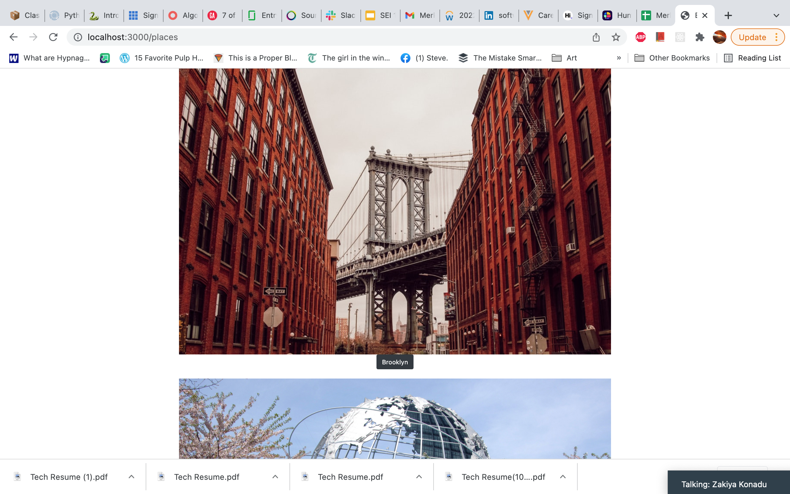

### NYscene

---

 
 
 

### Introduction
NYscene is a web application built for the purposes of collecting places(museums, bars, restaurants) to your collections with the intention of visiting said place.

### Motivations

As a NYC native I've received guests over the years who want to enjoy the city and know what are the best spots. I figured an application with serves this need would help both visitors and residents alike

 

### Game Link and Guide

[From Above](https://fromabove.surge.sh/)

The Begin Adventure button will take the player to the introductory story. Clicking Start Game will start the game. 
It is simple: Read the story shown and click on which path you would take as the protagonist. An example is shown below:

 

### Technologies Used

Languages: Javascript, HTML, CSS, ESJ
Frameworks/Libraries: Node.JS, Express, Mongoose, Bootstrap
Database: MongoDB
API: Google Places API

### Next Steps

The app met and exceeded expectations in terms of functionality given my experience level. With that said, stylistic improvements are much needed.

